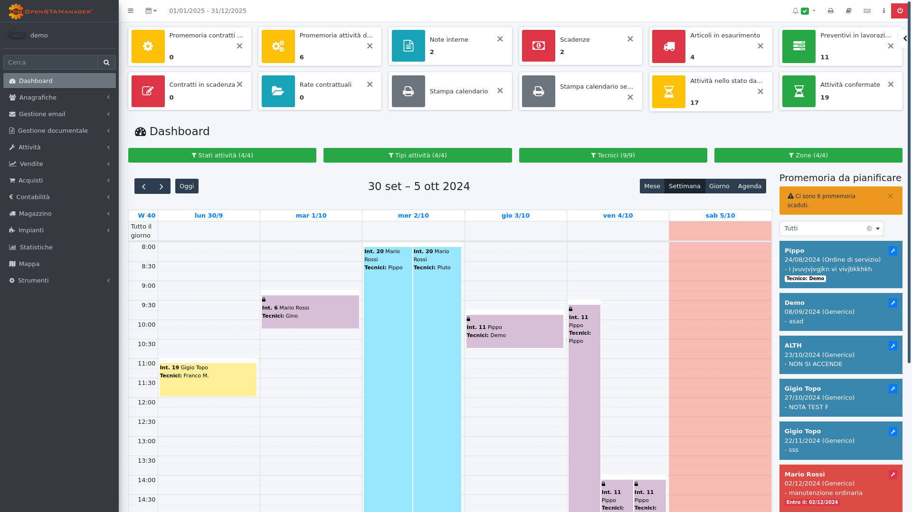

<p align="center">
  

  <p align="center">
    Il gestionale per l'assistenza tecnica e la fatturazione elettronica.
    <br>
    <br>
    <a href="https://github.com/Samueleattina04/OSM_Clone">Repository</a>
    &middot;
    <a href="#installazione">Installazione</a>
    &middot;
    <a href="#licenza">Licenza</a>
  </p>
</p>

[](LICENSE)



Safix è un software gestionale web based per gestire ed archiviare il servizio di assistenza tecnica e la relativa fatturazione, pensato per essere distribuito come prodotto chiavi in mano ai propri clienti.

Un software gestionale, identificato nell'insieme degli applicativi che automatizzano i processi di gestione all'interno delle aziende, appartiene solitamente a una specifica categoria del settore, specializzata negli ambiti di:

- Gestione della contabilità;
- Gestione del magazzino;
- Gestione e ausilio della produzione;
- Gestione e previsione dei budget aziendali;
- Gestione ed analisi finanziaria.

Secondo questa definizione, Safix riesce a generalizzare al proprio interno le funzionalità caratteristiche della contabilità e della gestione del magazzino, presentando inoltre moduli piuttosto avanzati e destinati a complementare l'attività aziendale in relazione agli interventi di assistenza della realtà lavorativa in oggetto.

<!-- TOC depthFrom:2 depthTo:6 orderedList:false updateOnSave:true withLinks:true -->

- [Requisiti](#requisiti)
- [Installazione](#installazione)
    - [Versioni](#versioni)
    - [Build](#build)
    - [Strumenti di sviluppo e debug](#strumenti-di-sviluppo-e-debug)
- [Licenze e abbonamenti](#licenze-e-abbonamenti)
- [Licenza](#licenza)

<!-- /TOC -->

## Requisiti software

L'installazione del gestionale richiede la presenza di un server web con abilitato il [DBMS MySQL](https://www.mysql.com) (o MariaDB) e il linguaggio di programmazione [PHP](https://php.net) >= 8.1.

### Requisiti hardware

Minimi:
- 1 CPU
- 2GB di ram
- 200MB di spazio per il gestionale

Consigliati:
- 2 CPU
- 4GB di ram
- 2GB di spazio per il gestionale

## Installazione rapida
```bash
git clone https://github.com/Samueleattina04/OSM_Clone.git
cd OSM_Clone

# Download di composer da https://getcomposer.org/download/

yarn develop-OSM
```

## Installazione

Per procedere all'installazione è necessario seguire i seguenti punti:

1. Scaricare una release ufficiale del progetto.
2. Creare una cartella nella root del server web installato ed estrarvi il contenuto della release scaricata. Il percorso della cartella root del server varia in base al software in utilizzo:

   - LAMP (`/var/www/html`)
   - XAMPP (`C:/xampp/htdocs` per Windows, `/opt/lampp/htdocs/` per Linux, `/Applications/XAMPP/htdocs/` per MAC)
   - WAMP (`C:\wamp\www`)
   - MAMP (`C:\MAMP\htdocs` per Windows, `/Applications/MAMP/htdocs` per MAC)

3. Creare un database vuoto (tramite [PHPMyAdmin](http://localhost/phpmyadmin/) o riga di comando).
4. Accedere all'indirizzo configurato dal vostro browser.
5. Inserire i dati di configurazione per collegarsi al database.
6. Procedere all'installazione del software, cliccando sul pulsante **Installa**.

**Attenzione**: è possibile che l'installazione richieda del tempo. Si consiglia pertanto di attendere almeno qualche minuto senza alcun cambiamento nella pagina di installazione (in particolare, della progress bar presente) prima di cercare una possibile soluzione.

### Versioni

Per mantenere un elevato grado di trasparenza riguardo al ciclo delle release, seguiamo le linee guida [Semantic Versioning (SemVer)](https://semver.org/) per definire le versioni del progetto.

### Build

Nel caso si stia utilizzando la versione direttamente ottenuta dalla repository di GitHub, è necessario eseguire i seguenti comandi da linea di comando per completare le dipendenze PHP (tramite [Composer](https://getcomposer.org)) e gli assets (tramite [Yarn](https://yarnpkg.com)) del progetto.

```bash
composer install
yarn install
npx gulp
```

In alternativa alla sequenza di comandi precedente, è possibile utilizzare il seguente comando (richiede l'installazione di GIT e Yarn):

```bash
yarn run develop-OSM
```

### Docker

E' disponibile un'immagine Docker con Apache e MySQL preconfigurati con PHP 8.3. Per creare un container:

```bash
docker compose up --build -d
```

**IMPORTANTE:**
- è suggerito cambiare i dati di connessione al database contenuti nel file `docker/docker-compose.yml` (almeno `DB_PASSWORD`)

## Strumenti di sviluppo e debug

Riepilogando, per compilare occorre installare i seguenti strumenti:
 - **php** >= 8.1 con estensioni:
   - php-curl
   - php-dom
   - php-intl
   - php-json
   - php-xml
   - php-mbstring
   - php-pdo
   - php-xsl
   - php-zip
 - **composer** v2: https://getcomposer.org/download/
 - **nodejs** >= v22: https://nodejs.org/en/learn/getting-started/how-to-install-nodejs
 - **yarn** >= v4.6.0: https://classic.yarnpkg.com/en/docs/install
 - **gulp** v4: https://gulpjs.com/docs/en/getting-started/quick-start/#install-the-gulp-command-line-utility

## Licenze e abbonamenti

Safix viene distribuito ai clienti secondo il seguente modello commerciale:

- **Licenza una tantum**: pagamento iniziale unico per l'attivazione del gestionale.
- **Abbonamento mensile di manutenzione**: copre aggiornamenti, assistenza e manutenzione ordinaria (il contenuto esatto è definito contrattualmente con ciascun cliente).
- **Funzionalità aggiuntive a pagamento**: nuovi moduli o sezioni personalizzate vengono sviluppati e fatturati separatamente su richiesta del cliente.

Lo stato della licenza e dell'abbonamento di ciascuna installazione si configura nella sezione `$license` di `config.inc.php` (vedi `config.example.php`) ed è visibile al cliente nella pagina **Informazioni** del gestionale.

## Prestazioni

Per ottenere prestazioni ottimali in produzione:

- Abilitare **OPcache** sul server PHP (impostazioni consigliate in `docker/php.ini` per chi usa l'immagine Docker inclusa).
- Il file `.htaccess` incluso abilita già compressione (mod_deflate) e cache del browser di un anno per gli assets compilati in `assets/dist` (versionati automaticamente, quindi sicuri da cachare a lungo).
- Preferire **PHP-FPM** rispetto a `mod_php` sotto carico.
- Assicurarsi che MySQL/MariaDB abbia una configurazione di memoria (`innodb_buffer_pool_size`) adeguata al volume dati.

## Licenza

Questo progetto è tutelato dalla licenza [**GPL 3.0 or later**](LICENSE).

Safix è un software derivato da **OpenSTAManager** (di DevCode s.r.l.), rilasciato anch'esso con licenza GPL-3.0. Si richiede che qualsiasi distribuzione del software (o di sue versioni modificate) includa una copia del codice sorgente completo, la presente menzione al software originale **OpenSTAManager** e una copia della licenza GPL 3.
